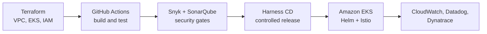

## About me

I am a Senior AWS Platform Engineer with 12+ years of experience. I design, run and secure cloud platforms for banks and large enterprises. I work mostly with Amazon EKS, Terraform, CI/CD and Amazon Connect. I am based in New Delhi and open to relocation.

## Impact in numbers

| | |
|---|---|
| **12+** years in infrastructure and cloud | **12** AWS accounts managed |
| **4** production EKS clusters | **100+** microservices on Kubernetes |
| **EUR 200K** yearly savings from decommissioning a legacy application | **Best Employee of the Year** at IBM |

## How I build platforms

## What I do

- **Kubernetes and EKS:** cluster upgrades, autoscaling, node groups, Helm releases and Istio traffic management for 100+ services.
- **Infrastructure as code:** repeatable AWS environments with Terraform, Ansible and HashiCorp Vault.
- **CI/CD and DevSecOps:** GitHub Actions pipelines, Harness releases, and Snyk, SonarQube and GitHub Advanced Security checks.
- **Amazon Connect:** contact flows, queues, routing profiles, outbound dialers, Contact Lens, and Lambda integrations for banking journeys.
- **Reliability:** observability, incident management and root cause analysis for production platforms.

## Tech stack

## Certifications

## Featured work

| Project | What it is |
|---|---|
| [Sameer-AI-Labs](https://github.com/khansameer421421/Sameer-AI-Labs) | Practical AI agent guides, automation projects and tutorials. |
| [voiceflow-career-agent](https://github.com/khansameer421421/voiceflow-career-agent) | An AI job search and ATS scoring assistant built as a Voiceflow agent workflow. |

## Currently exploring

- AI agents and automation on AWS
- Serverless platform optimisation
- Reliability engineering across multiple clouds

## Let's talk

Ask me about EKS cluster management, Istio, Terraform, DevSecOps pipelines and Amazon Connect flow design. I am happy to collaborate on open-source Kubernetes and Terraform work.

